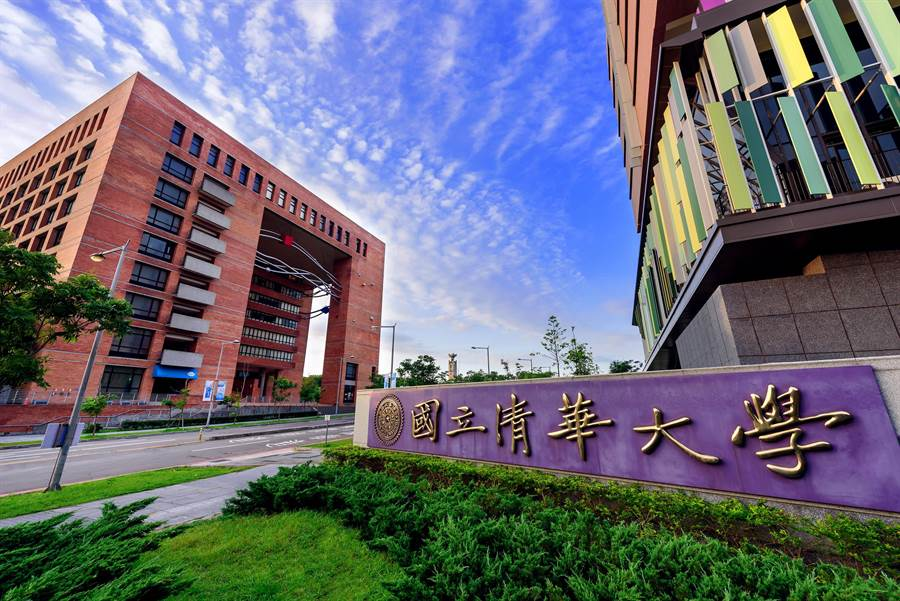
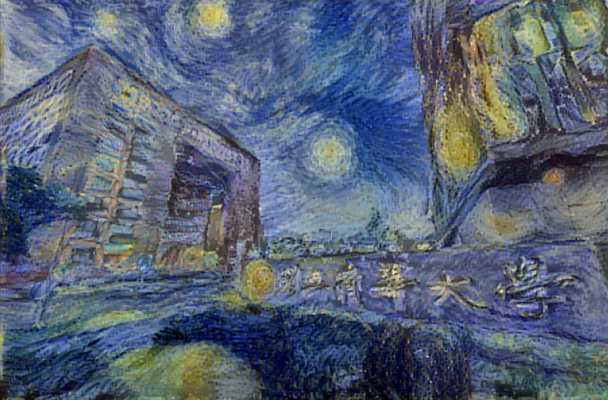

# Style Transfer

## Overview

The Style Transfer project is an exciting application of deep learning that allows you to transfer the artistic style of one image onto the content of another image. Using Convolutional Neural Networks (CNNs) and techniques like Gram Matrix computation, this project enables you to create stunning and visually appealing artwork.

## How it Works

The project is built using the following technologies:

- Python
- TensorFlow
- NumPy
- Matplotlib

## Features

- Image Style Transfer: Transfer the artistic style of one image onto the content of another image to create unique and artistic visuals.
- Customizable Parameters: Adjust various parameters like style weight, content weight, and number of iterations to control the style transfer process.
- Visualization: Visualize the original content image, style image, and the stylized output.
